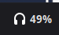

# Logitech Headset Battery

A Cinnamon panel applet for Linux Mint that displays the Logitech A20 X wireless headset battery percentage.



## Requirements

- Linux Mint with Cinnamon desktop
- Logitech A20 X wireless headset + USB dongle (USB ID `046d:0b35`)
- Python 3

## Installation

```bash
git clone https://github.com/jordan-lee-code/logitech-headset-battery.git
cd logitech-headset-battery
bash install.sh
```

Then install the udev rules so the dongle and wired USB device are accessible without root:

```bash
sudo cp 99-logitech-a20x.rules /etc/udev/rules.d/
sudo udevadm control --reload-rules && sudo udevadm trigger --subsystem-match=hidraw
```

Finally, enable the applet: **right-click the panel → Applets → Logitech Headset Battery → Add to Panel**.

## Usage

- Battery percentage is shown in the panel next to a headphone icon
- Colour coding: green (>50%), yellow (20–50%), red (≤20%)
- `⚡` suffix when the headset is charging
- Notification when battery drops to 20% or below
- Shows `--` when the headset is disconnected from the dongle
- Updates every 60 seconds, or click the applet to refresh immediately
- The first reading appears after the headset connects to the dongle — if the panel shows `--` on first load, wait a few seconds and click to refresh

## Charging detection

Charging is detected in two ways:

1. **USB data cable plugged in** — the wired USB device (`046d:0b2e`) appears when the cable is connected to a data port, and its presence is taken as charging
2. **BLE battery notification** — if the headset reports charging state over BLE (happens on reconnect after a power cycle), that is used directly

Charge-only connections (power-bank, charger brick, charge-only cable) are not detectable — the headset must either reconnect over BLE or be plugged into a data-capable USB port for the ⚡ to appear.

## License

MIT

## How it works

The A20 X dongle exposes a firmware debug log via a HID feature report. Battery level and charging state are logged after each BLE connection between the dongle and headset. `battery_reader.py` reads this log passively (no commands sent to the dongle) and caches the last known value for up to 7 days to handle stable sessions.
